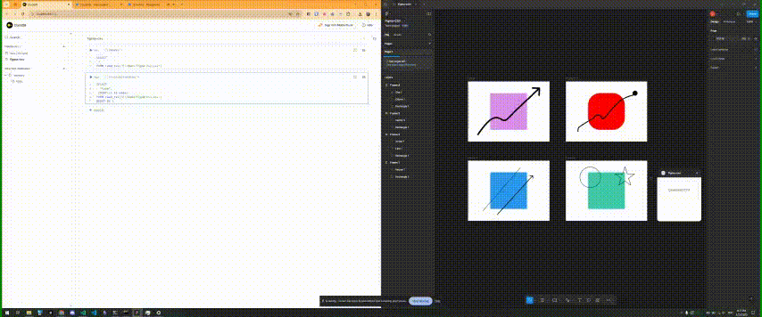

# Figma CSV

saves figma document as CSV (.csv)

## How to use

In Figma
1. clone this repo
2. In **Desktop Figma**, go to Plugins > Development > Import Plugin from manifest
   1. Select the `manifest.json` file in the root of this repo
3. Navigate to a project page and click "Download CSV"

## Roadmap

- More fields properties
- Watch mode - export to same .csv when edit detected
- Reverse - make changes from .csv too project page   